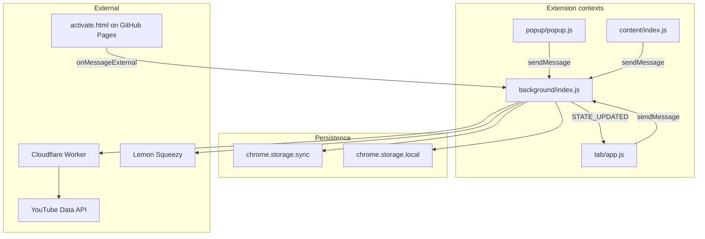

# Architecture

## Context diagram



## Service worker lifecycle

- MV3 SW **suspends** when idle; globals are lost except what is reloaded on wake.
- Every message handler calls `ensureInit()` first (with retry, max 3 attempts).
- `onInstalled` / `onStartup` also call `ensureInit()`.

### Init sequence (`init()`)

1. `store.loadFromStorage()` — sync: settings + license; local: series
2. `reverifyLicense()` if Pro and cache expired
3. API key: skip if `API.WORKER_BASE` set; else fetch `config.js` or use `settings.apiKey`
4. Alarms: `autoRefresh` (Pro + setting), `licenseHeartbeat` (daily)

## Opening the dashboard

| Trigger | Mechanism |
|---------|-----------|
| Popup “Open Dashboard” | `OPEN_SERIES_TAB` |
| Content sidebar link | `OPEN_SERIES_TAB` |
| `chrome.action.onClicked` | `openSeriesTab()` directly |
| Notification click | Opens `index.html?series={playlistId}` |

`openSeriesTab()` focuses existing tab with matching extension URL or creates one.

## State flow (mutations)

1. Client sends `{ type, payload }` to background
2. Handler validates → mutates `store` → `saveToStorage()`
3. `broadcastStateUpdate()` sends `{ type: STATE_UPDATED, state, _broadcast: true }`
4. Tab `listenBroadcasts()` updates local `state` and re-renders

**Exception:** `handleStorageReset()` resets storage but does not broadcast (tab may be stale until reload).

## Store pattern

- Singleton `store` in `src/state/store.js`
- Reads return shallow copies (`getState()`, `getSeriesById()`, etc.)
- `_listeners` map exists but primary sync is **runtime messaging**, not store subscriptions

## Security (messages)

- Internal messages: reject if `sender.id !== chrome.runtime.id` (unless `_broadcast`)
- Incoming `_broadcast` messages are ignored in the handler (no loop)
- External: only `ACTIVATE_LICENSE` on `onMessageExternal`; host must match `externally_connectable` in manifest

## CSP (extension pages)

Defined in `manifest.json` → `content_security_policy.extension_pages`:

- `connect-src`: self, worker, googleapis, lemonsqueezy
- `frame-src`: youtube.com, youtube-nocookie.com (hover previews)
- No remote scripts on extension pages

## File layout

```
src/
  background/index.js    # Orchestrator
  content/index.js       # YouTube DOM integration
  popup/                 # Toolbar popup
  tab/                   # Main dashboard
  state/store.js         # State + persistence
  services/              # youtube, license, chrome wrappers
  shared/                # events, constants, i18n, logger
cloudflare-worker/       # API proxy (separate deploy)
icons/                   # Generated PNGs (npm run icons)
```

## Related

- Messages: [02-message-protocol.md](02-message-protocol.md)
- Data shapes: [03-data-model.md](03-data-model.md)
